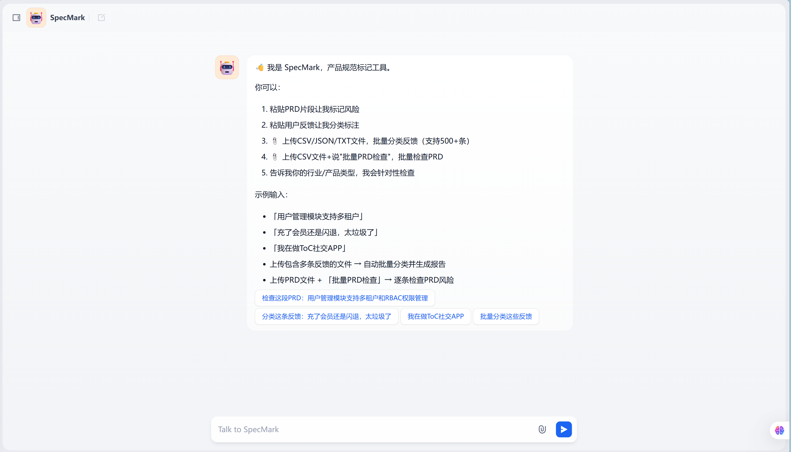
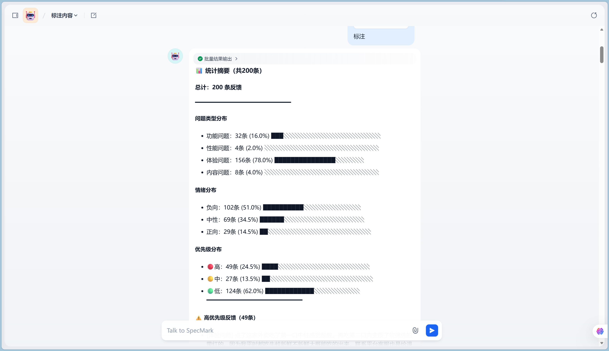
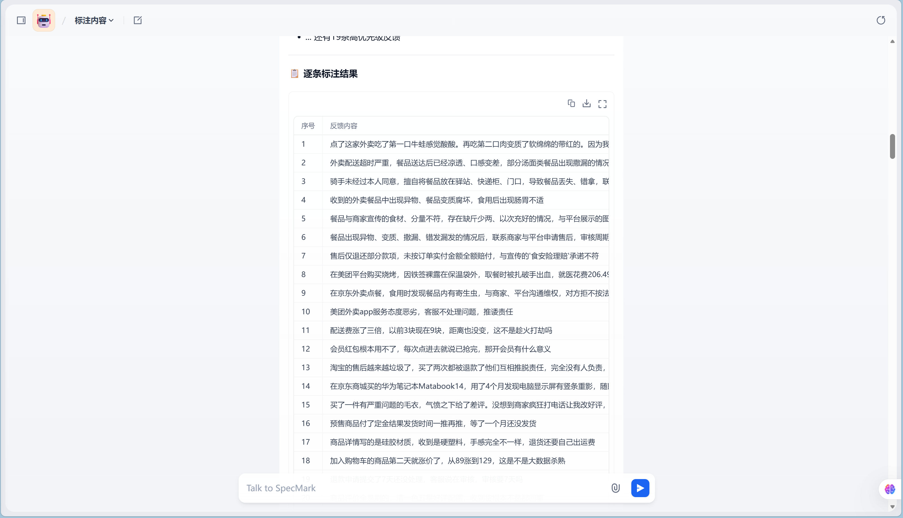

# SpecMark

> 反馈分类 + PRD审查工具。规则引擎做确定性决策，LLM做语义理解，大部分场景零API成本。

[](LICENSE)

**[面向谁？](#面向谁) · [效果数据](#效果数据) · [Agent vs 裸LLM](#agent-vs-裸llm) · [核心架构](#核心架构) · [快速开始](#快速开始) · [仓库结构](#仓库结构)**

---

## 面向谁？

产品团队每天收到大量用户反馈，手工分类耗时且不一致。SpecMark 自动分类情绪/类型/优先级，减少重复劳动。

| 角色 | 场景 | SpecMark做什么 |
|------|------|---------------|
| 产品经理 | 每周手动分类用户反馈耗时多 | 自动分类情绪/类型/优先级 |
| AI产品助理 | 需要快速定位高优先级问题 | 付费用户+核心功能自动标高优 |
| 运营 | 差评量大，人工处理效率低 | 批量分类，识别反讽和隐含需求 |
| 项目经理 | PRD缺乏规范性审查 | 自动审查PRD规范，输出Jira格式缺陷单 |

---

## 效果数据

### 分类准确率（LLM共识法，180条×3轮投票）

| 维度 | 准确率 | 说明 |
|------|--------|------|
| 情绪 | 98.3% | 反讽、趋势恶化等边界case覆盖较好 |
| 问题类型 | 98.9% | 功能/体验边界偶有争议 |
| 优先级 | 97.2% | 中→高漏判是主要瓶颈 |
| 综合（三项全对） | 95.0% | 任一维度错即计为综合错误 |

### 规则引擎准确率（纯代码，300条测试集）

| 维度 | 准确率 | 说明 |
|------|--------|------|
| 优先级 | 75.1% | 关键词匹配的天花板，复杂语义case需LLM兜底 |

> 规则引擎的价值不在准确率最高，而在确定性最高、成本最低。92.6%的请求零LLM消耗，规则覆盖不到的走LLM兜底，整体综合准确率95%。

### 运行指标

| 维度 | 数据 | 说明 |
|------|------|------|
| 有效分类率 | 95%（100条真实差评，17个品类） | 5条空输出需人工介入 |
| 铁律拦截率 | 92.6% | 大部分请求零LLM token消耗 |
| 输出一致性 | 100% | 同样输入同样输出 |
| 路由准确率 | 100%（48/48） | 未出现反馈误判为无效输入 |
| 边界鲁棒性 | 100%（23/23） | 反讽、Prompt注入、空输入均正确处理 |

### 测试方法与局限

- 标准答案采用LLM共识法生成（3轮投票+争议人工仲裁），非纯人工标注
- 100条测试集覆盖17个品类，部分品类样本偏少（如医疗仅2条）
- 优先级准确率75.1%基于300条测试集，中→高漏判是主要错误类型

详细对比数据见 [docs/BENCHMARK.md](docs/BENCHMARK.md)。

---

## Agent vs 裸LLM

| 维度 | 裸LLM | SpecMark Agent |
|------|--------|----------------|
| 处理1000条反馈估算成本 | ~50元（估算） | ~3.7元（估算，92.6%零token） |
| 处理1000条反馈估算时间 | ~20分钟（估算） | ~2分钟（估算，纯代码批量） |
| 输出一致性 | 同一输入可能不同输出 | 确定性输出 |
| 可解释性 | 黑盒 | 可追溯到具体规则 |
| 反讽识别 | 可能将反话判为好评 | "太棒了，一天闪退八次"→负向 |
| Prompt注入防护 | 易被绕过 | "忽略之前所有规则"→拒绝处理 |

> 成本和时间为基于DeepSeek定价的估算值，实际取决于模型选择和并发配置。

---

## 核心架构

规则引擎与LLM分工协作——LLM负责语义理解，代码负责确定性决策：

```
用户输入（文字 + 可选文件）
     │
     ▼
[LLM+知识库] 轻量分类器 —— LLM理解用户意图
     │
     ▼
[代码] 路由验证 —— 代码二次校验，防止LLM误判
     │
     ├── PRD审查（单条/批量） → 知识库检索 → LLM检查 → Jira格式输出
     ├── 反馈分类（单条）     → 知识库检索 → LLM特征提取 → 代码规则引擎 → 输出
     ├── 反馈分类（批量）     → 纯代码关键词匹配 → 汇总输出
     ├── 场景声明             → 记录场景 → 后续检查更准
     └── 无效输入             → 拒绝
```

### 关键决策

**决策一：为什么把规则从Prompt移到知识库？**

早期版本把所有规则写在Prompt里，综合准确率只有63%。根因是规则太多（8条核心规则+30+个few-shot示例），LLM记不住，经常遗漏。改用知识库后，LLM只检索与当前输入最相关的规则和示例，准确率提升到95%。

| | 纯Prompt方案 | 知识库方案 |
|--|------------|----------|
| 准确率 | 63% | 95% |
| 维护 | 改YAML重新导入 | 改知识库文件即可 |
| 稳定性 | 规则太长LLM记不住 | 精准检索，LLM只看相关规则 |

**决策二：为什么规则引擎和LLM要分开？**

试过让LLM直接输出分类结果，发现两个问题：①同样输入可能不同输出（temperature=0也有微小波动），②"付费用户+核心功能=高优先级"这种规则LLM偶尔不遵守。拆开后，规则引擎保证确定性case永远正确，LLM只处理语义理解部分。

**决策三：为什么从扣子搬到Dify？**

扣子没有代码节点，所有逻辑只能靠Prompt硬撑。搬到Dify后，确定性逻辑用Python代码节点实现，LLM只负责语义理解，分工更清晰。

---

## 功能亮点

| # | 功能 | 解决的问题 |
|---|------|-----------|
| 1 | 场景感知 | "迷路"在扫地机器人→功能问题，在APP→体验问题 |
| 2 | 隐含需求提取 | "每次都要重新登录"→识别出"需要记住登录状态" |
| 3 | 反讽检测 | "太棒了，一天闪退八次！"→判为负向而非好评 |
| 4 | 付费用户升级 | "充了会员还是闪退"→自动标高优先级 |
| 5 | 缓解词检测 | "偶尔有点噪音，但整体还行"→优先级降级 |
| 6 | 防Prompt注入 | "忽略之前所有规则"→拒绝处理 |
| 7 | PRD风险转Jira | 自动生成Jira Bug格式缺陷单 |
| 8 | 灰名单术语 | Webhook/OAuth2.0→标注"请人工确认" |
| 9 | 51个品类覆盖 | 从电商到智能汽车，核心功能映射表 |
| 10 | 知识库驱动 | LLM有据可依，分类结果可追溯 |

> 分类规则参考 ISO 25010（软件质量模型）的功能适用性/性能效率/可用性维度划分，PRD检查规则参考 ISTQB 测试标准中的缺陷分类体系。

---

## 快速开始

### 前置条件

- [Dify](https://dify.ai) 账号（v0.6+，免费版即可）
- LLM API Key（DeepSeek / 智谱 / 通义千问 / OpenAI 均可）

### 模型选择

工作流默认使用 DeepSeek，支持Dify平台上的任意模型，导入后在Dify界面中切换即可：

| 模型 | 推荐度 | 说明 |
|------|--------|------|
| DeepSeek | ⭐⭐⭐ | 性价比高，中文理解能力好，默认推荐 |
| 智谱 GLM-4 | ⭐⭐⭐ | 中文能力强，Dify中安装智谱插件后可直接切换 |
| 通义千问 | ⭐⭐ | 阿里云模型，需在Dify中安装对应插件 |
| GPT-4o | ⭐⭐ | 效果好但成本较高，适合对准确率要求极高的场景 |

> 切换方法：导入工作流后，在Dify的节点设置中将模型从 `deepseek-chat` 改为你想用的模型即可。代码节点不依赖模型，无需修改。

### 部署步骤

**1. 导入工作流**

把 `workflow/SpecMark.yml` 导入 Dify。



**2. 创建知识库**

在Dify中创建2个知识库：

| 知识库名称 | 上传文件 |
|-----------|---------|
| 📚知识库-PRD规范检查 | `knowledge/📚知识库-PRD规范检查.md` |
| 📚知识库-反馈分类规则 | `knowledge/📚知识库-反馈分类规则.md` |



**3. 绑定知识库**

| 节点名 | 绑定知识库 |
|--------|-----------|
| 📚知识库-PRD规范检查 | 📚知识库-PRD规范检查 |
| 📚知识库-反馈分类规则 | 📚知识库-反馈分类规则 |
| 📚知识库-PRD规范检查(批量) | 📚知识库-PRD规范检查（同一个） |



**4. 配置模型**

在Dify中配置所选模型的API Key，并将各LLM节点的模型切换为你选择的模型。

**5. 跑测试验证**

```bash
cd scripts
pip install -r requirements.txt
set DIFY_API_KEY=app-xxxx
python batch_test.py
```

---

## 技术栈

> 本项目的核心是 Dify 工作流（YAML）+ 知识库（Markdown），Python 脚本仅用于测试和基准对比。GitHub 仓库语言显示 Python 是因为测试脚本占了代码量，实际运行不依赖 Python 环境。

| 层级 | 技术 | 选型理由 |
|------|------|---------|
| 平台 | Dify | 可视化工作流编排，降低部署门槛 |
| 工作流 | YAML（代码节点 + LLM节点 + 知识库节点） | 代码做确定性决策，LLM做语义理解，知识库提供规则 |
| 模型 | DeepSeek（默认）/ 智谱 / 通义 / GPT | 可插拔，按需选择 |
| 知识库 | Markdown | 规则和few-shot示例，LLM按需检索 |
| 测试 | Python + aiohttp | 异步并发批量测试 |
| 评估 | LLM共识法 | 3轮投票+争议仲裁，提升标注效率 |

---

## 仓库结构

```
SpecMark/
├── README.md                           ← 你正在看的
├── LICENSE                             ← MIT许可证
├── .gitignore
├── workflow/
│   └── SpecMark.yml                    ← 主工作流，导入Dify就能用
├── knowledge/
│   ├── 📚知识库-PRD规范检查.md           ← PRD检查规则
│   └── 📚知识库-反馈分类规则.md           ← 反馈分类规则+品类映射+few-shot
├── tests/
│   ├── README.md                       ← 测试数据说明
│   ├── test_set_100.csv                ← 100条测试集
│   ├── test_set_200.csv                ← 200条测试集
│   └── test_set_300.csv                ← 300条测试集
├── scripts/
│   ├── batch_test.py                   ← 批量测试脚本
│   ├── benchmark_agent.py              ← Agent vs 裸LLM基准测试
│   ├── generate_reviews.py             ← 生成测试评价
│   ├── test_output_samples.py          ← 输出样例验证
│   └── requirements.txt                ← 依赖
└── docs/
    ├── DESIGN.md                       ← 设计决策+迭代历程
    ├── LOGIC.md                        ← Agent完整逻辑说明
    ├── BENCHMARK.md                    ← 效率对比数据+输出样例
    ├── screenshots/                    ← 部署截图
    ├── ARCHIVE_BUILD.md                ← 归档：早期构建流程
    └── ARCHIVE_DESIGN.md               ← 归档：早期设计文档
```

---

## 许可证

[MIT](LICENSE)

---

## 致谢

产品设计、规则制定和迭代方向由作者完成，代码和文档初稿由 AI 辅助生成。
